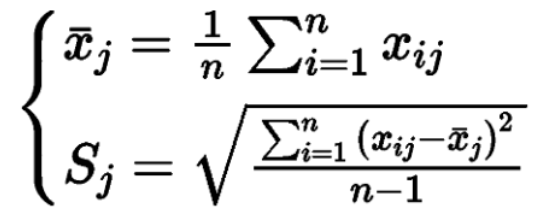
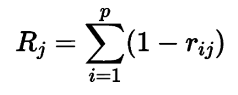
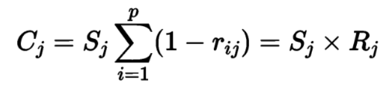
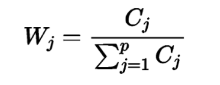
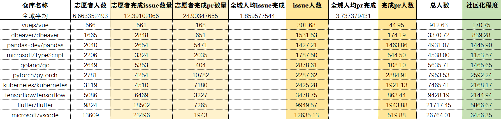
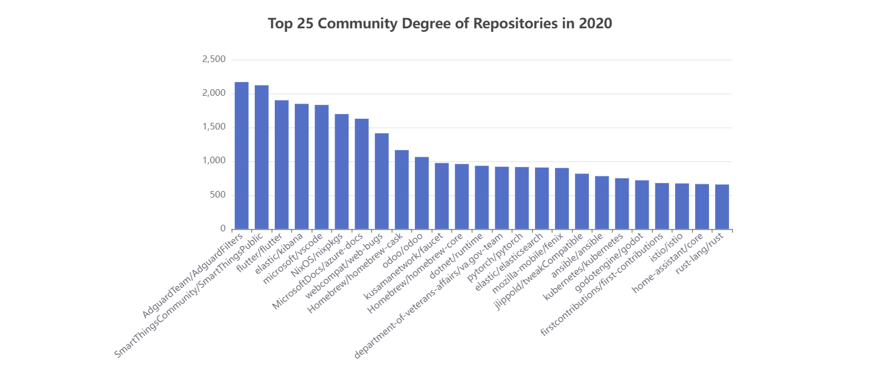
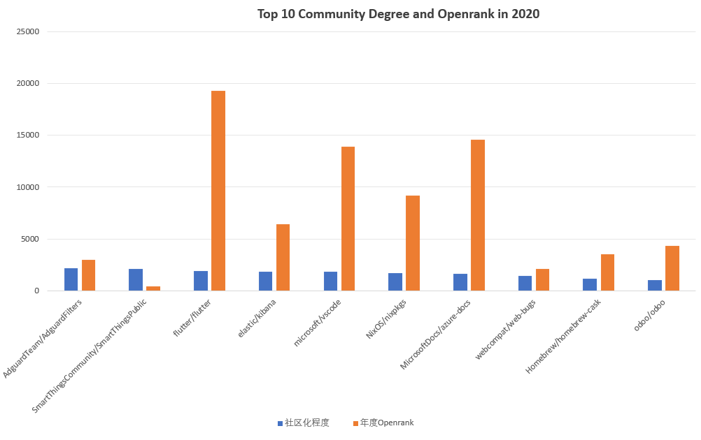
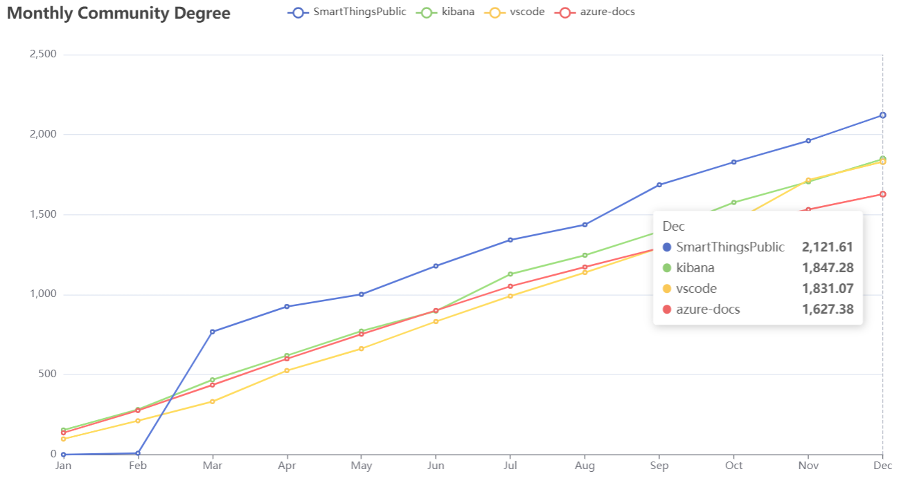
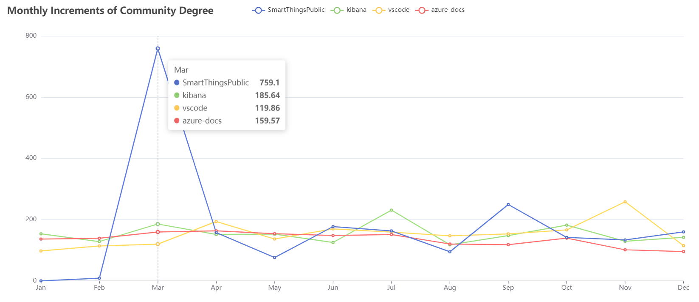

# 开源项目社区化程度评估指标

### 一、描述

**开源项目的社区化程度评估指标，就是用来评估社区志愿者（除了项目仓库的拥有者及其所包含的成员之外，自愿参与项目进行贡献的社会人员）对项目的参与情况的指标。**

### 二、背景意义

开源项目社区化程度是一个评估开源项目**开放程度**的指标。一个开源项目的社区化程度越高，意味着它有更多的**除仓库拥有者和成员以外的社区志愿者**积极地参与和支持该项目。一个高度社区化的开源项目通常会有大量的社区贡献者，他们会在不同的方面为项目做出贡献，包括代码编写、文档编写、Bug修复等。同时，社区成员之间的互动也会促进项目的进步和发展。

开源项目的社区化程度对于开源软件行业的发展具有重要意义。一方面，社区成员可以共同维护和发展该项目，从而为用户提供更好的软件体验；另一方面，开源项目的社区化程度也反映了**开源软件行业的发展状况和潜力**。因此，衡量开源项目社区化程度是非常重要的，可以帮助我们了解开源项目的成长和发展情况，同时也可以作为决策参考，帮助我们更好地投入资源和支持开源项目的发展。

当一个开源项目的社区化程度越高，它就越能够吸引更多的社区志愿者参与进来，并且这些志愿者能够为该项目作出贡献，进而推动项目的不断发展和完善。这对于开源项目的可持续发展和技术进步是非常重要的，因为它意味着更多的社区上的人可以参与到项目中来，不仅能够为项目贡献代码、文档、测试等方面的工作，还能够为项目提供更广泛的使用场景和反馈意见，从而使项目更加符合用户需求和市场趋势。

另外，一个高度社区化的开源项目也可以带来更广泛的影响和更高的知名度。通过开源项目的社区化程度，可以让更多的人了解该项目，并且吸引更多的人加入到该项目的社区中来。这不仅能够**提高该项目的可信度和可靠性**，还可以**促进知识共享和技术创新**，从而**带动整个开源社区的发展**。

最后，一个高度社区化的开源项目也能够**促进开源文化的普及和推广**。开源项目强调开放、透明、共享和合作的精神，这与现代社会的价值观和发展趋势是高度一致的。**因此，通过开源项目的社区化程度，可以让更多的人了解和认同开源文化的核心价值观和实践原则，进而推动开源文化的普及和推广**。

### 三、目标及设计思路

- 通过每一个项目的志愿者人数 **（广度）** 、志愿者完成的 issue 数量 **（深度）** 、志愿者完成的 pr 数量 **（深度）** 三个维度的综合分析确定该项目的社区化程度，具体设计思路如下：

  1.结合实际数据情况，找到可以获取各个维度的数据库字段

  2.结合该维度的数据分布情况，判断是否进行预处理，如进行聚类，分段函数赋权值，取平均值，去最大最小值等等尝试

  3.根据尝试结果，最终选择合适预处理方法，并调整拟合公式

  4.利用最终公式，并结合已有数据进行代入实验

### 四、实现

1. **整体公式**

   

   - 从**广度**的角度来考虑，获得全域的志愿者Issue处理量，并舍弃前5%和后5%的数据（只是在计算全域人均这一步中舍弃了），避免数据过小，以及存在机器人造成的数据量过大的问题。利用中间的90%的数据得到全域人均志愿者Issue处理量。
   - 我们认为衡量一个项目社区化的**深度**最重要的两个值，就是志愿者**完成**的Issue量和志愿者PR的合入量，再除以全域人均志愿者的完成量，以得到该项目的完成Issue和合入PR的志愿者人数
   - 我们认为完成Issue和合入PR的志愿者人数可能不是一样重要，而且他们各自的重要性可能会随着时间变化，于是，我们使用CRITIC权重赋值法动态的给这两项赋值，**最终计算公式**如下：
   - 其中：权重1 + 权重2  = 100%，这里赋权重使用的方法是**CRITIC权重赋值法**，并且该权重值的分配会根据项目中数据的持续变化而**动态调整**，以保证指标计算结果的客观准确性。

2. **数据来源及处理**

   以2020年一年的 Github 全域日志数据为例，在 Clickhouse 数据库中共有 54,205,690 个仓库，其中私有仓库（设置成 private 的仓库）为 4,265,045 个，经过实验我们总共利用了 200,234 个非私有仓库的数据（因为有些非私人仓库可能没有 IssueEvent 和 PullRequestEvent 类型事件的发生），其中主要获取了各个仓库的三类数据：

   - 从关闭 Issue 中获取志愿者完成的 Issue 数量

      **具体操作** ：首先通过字段 org_id 过滤掉私人仓库的事件，私人仓库是没有 member 的，然后在过滤完的仓库中通过 type 字段提取仓库事件类型为 IssueEvent 的事件，通过 action 字段找到所有关闭的 issue，通过 issue_author_type 字段过滤掉机器人的评论。最后通过字段 issue_author_association找到志愿者的 issue，利用聚集函数得到关闭 issue 中志愿者的 issue 数量。

   - 从关闭 PR 中获取志愿者的 PR 数量

      **具体操作**与上面的步骤基本相同，唯一不同的一点是在这里需要提取仓库事件类型为 PullRequestEvent 的事件。

   - 获取各个项目中的志愿者人数

      **具体操作** ：由于仓库中并没有与志愿者直接相关的数据，所以我们的做法是先得到关闭 issue 中所有志愿者的名字、关闭 pr 中所有志愿者的名字，进而将两个表通过仓库 id 进行连接，并将得到的志愿者名字进行一个去重，最后的结果即为仓库的所有志愿者名字，并利用聚集函数得到所包含的志愿者数量。

3. **CRITIC权重赋值方法**

    **CRITIC 赋权法是一种比熵权法和标准离差法更好的客观赋权法。**
   
    它是基于评价指标的**对比强度**和**指标之间的冲突性**来综合衡量指标的客观权重。好处是在考虑指标变异性大小的同时兼顾指标之间的相关性，而并非单纯的把数字越大就越重要作为评价标准，从而更加完全地利用数据自身的客观属性来进行科学的评价。
   
    其中**对比强度**是指同一个指标各个评价方案之间取值差距的大小，以标准差的形式来表现。标准差越大，说明波动越大，即各方案之间的取值差距越大，权重会越高；**指标之间的冲突性**是用相关系数进行表示，若两个指标之间具有较强的正相关，说明其冲突性越小，权重会越低。
   
    对于 CRITIC 赋权法而言，在标准差一定时，指标间冲突性越小，权重也越小；冲突性越大，权重也越大；另外，当两个指标间的正相关程度越大时，（相关系数越接近 1），冲突性越小，这表明这两个指标在评价方案的优劣上反映的信息有较大的相似性。
   
    **具体计算步骤如下：**
   
    （1）首先根据数据的整体分布情况，选择出最小最大规范化、零均值规范化和小数定标规范化这三种最常用的数据归一化方法中最合适的一种方法，来对数据进行归一化。其中零均值规范化方法不适用于需要分析指标变异性的数据，因为这种方法会将数据的标准差规范到始终为 1，无法体现出指标的变异性，而小数定标规范化则是通过移动属性值的小数数位，将属性值映射到[-1，1]之间，移动的小数位数取决于属性值绝对值的最大值。同时归一化过程中还需注意正向指标和负向指标的处理方法是不尽相同的。
   
    （2）计算指标变异性。在 CRITIC 赋权法中使用标准差来表示各指标的内取值的差异波动情况，标准差越大表示该指标的数值差异越大，越能放映出更多的信息，该指标本身的评价强度也就越强，应该给该指标分配更多的权重，计算公式如下：
   
    
   
    其中 $S_j$ 表示第 $j$ 个指标的标准差。
   
    （3）计算指标冲突性。 CRITIC 赋权法中使用相关系数来表示指标间的相关性，与其他指标的相关性越强，则该指标就与其他指标的冲突性越小，反映出相同的信息越多，所能体现的评价内容就越有重复之处，一定程度上也就削弱了该指标的评价强度，应该减少对该指标分配的权重，计算公式如下：
   
    
   
    其中 $r_{ij}$ 表示评价指标 $i$ 和 $j$ 之间的相关系数。
   
    （4）计算信息量。CRITIC 赋权法中 $C_j$ 越大，第 $j$个评价指标在整个评价指标体系中的作用越大，就应该给其分配更多的权重，计算公式如下：
   
    
   
    （5）计算 CRITIC 权重。第 $j$ 个指标的客观权重$W_j$计算公式如下：
   
    

4. **举例说明**

   假设某项目1中的`志愿者人数`、`志愿者完成的Issue数量`和`志愿者的 PR 数量`分别为：`600, 300`；项目2中各维度数据分别为：`420, 360`；全域人均Issue处理量和全域人均志愿者PR和入量分别为6和3，各维度权重分配假定分别为：`70%, 30%`，那么最终这两个项目的社区化程度计算结果如下：
   
   项目1：社区化程度=600 / 6 * 70\% + 300 / 3 * 30\% = 100

   项目2：社区化程度=420 / 6 * 70\% + 360 / 3 * 30\% = 85 

   由上述结果表明，项目1的社区化程度应该是高于项目2的社区化程度的。

### 五、分析

1.**仓库社区化程度举例分析**

为了验证项目社区化程度评估指标的有效性，我们挑选了`GitHub`上十个知名的项目，利用社区化程度评估模型的方法，对这十个项目进行了社区化程度的评估计算。

例如在上表中，尽管`tensorflow`项目比`kubernetes`项目的志愿者人数多出了近 2000 人，但是`kubernetes`项目的志愿者所完成的pr数量却远高于`tensorflow`项目，这也就说明`kubernetes`项目中的志愿者是更加活跃的。最终通过模型计算，`tensorflow`项目的社区化程度得分为：2144.94 分，而`kubernetes`项目的社区化程度得分为：2168.17 分，确实略高于`tensorflow`项目的社区化程度。

从上述的社区化程度分析结果可以看出，我们的开源项目社区化程度评估模型能够结合`志愿者完成issue数量`和`志愿者完成pr数量`两个维度的数据，从而更加真实全面地反映出某个项目的社区化程度，而不再仅仅是让用户只能从项目中所包含的志愿者人数来片面的估计某项目的社区化程度。

2.**年度Top25社区化程度的仓库**

通过社区化程度指标，我们计算出2020年度Top25的社区化程度的仓库，结果如下图所示：

可以看到AdguardFilter和SmartThingsPublic两个仓库的年度社区化程度值较高，SmartThingsPublic为著名的SmartApp的公共仓库，除组织成员外，其他社区外的贡献者参与的贡献较多。AdguardFilter则是为Adguard广告拦截器和其他类似的广告拦截器创建过滤器的仓库，这个仓库也是吸引了大量的社区外的贡献者参与贡献。社区化程度前25的这些仓库几乎都是知名项目仓库，因为他们能吸引大量的用户进行关注，其中一部分非该组织成员的社区志愿者会参与项目其中，做出贡献，故提高了该项目的社区化程度。

3.**年度Top10社区化程度仓库的Star数**

|                仓库名称                | 社区化程度 | Star数量 |
| :------------------------------------: | :--------: | :------: |
|       AdguardTeam/AdguardFilters       |  2169.15   |   818    |
| SmartThingsCommunity/SmartThingsPublic |  2121.61   |   1832   |
|            flutter/flutter             |  1900.17   |  109895  |
|             elastic/kibana             |  1847.28   |  15398   |
|            microsoft/vscode            |  1831.07   |  108621  |
|             NixOS/nixpkgs              |  1696.14   |   6058   |
|        MicrosoftDocs/azure-docs        |  1627.38   |   4875   |
|           webcompat/web-bugs           |  1412.37   |   366    |
|         Homebrew/homebrew-cask         |  1163.98   |  17771   |
|               odoo/odoo                |  1062.43   |  20111   |

从表中可以看出，社区化程度较高的公司，star数量也比较多，尤其是flutter和vscode项目获得了超过十万的star数。一方面可以看出来，社区化程度能够正确评估出这些志愿者做贡献的仓库，社区化程度较大的仓库，star数量也不会少。从另一方面可以看出，可能是仓库受到GitHub用户的关注和star后，吸引了他们对该项目做出贡献，这样也增加了社区志愿者完成issue和pr的数量，即增大了该仓库的社区化程度。

4.**年度Top10社区化程度与Openrank值对比**

|                仓库名称                | 社区化程度 | 年度Openrank | Openrank总值 |
| :------------------------------------: | :--------: | :----------: | :----------: |
|       AdguardTeam/AdguardFilters       |  2169.15   | 2977.198303  |    8029.8    |
| SmartThingsCommunity/SmartThingsPublic |  2121.61   | 426.3595047  |    2064.3    |
|            flutter/flutter             |  1900.17   | 19302.56091  |   42408.4    |
|             elastic/kibana             |  1847.28   | 6443.680328  |   24868.7    |
|            microsoft/vscode            |  1831.07   | 13928.43188  |   61781.4    |
|             NixOS/nixpkgs              |  1696.14   | 9191.617188  |   33967.2    |
|        MicrosoftDocs/azure-docs        |  1627.38   | 14601.50012  |   40654.4    |
|           webcompat/web-bugs           |  1412.37   | 2116.311615  |    8077.4    |
|         Homebrew/homebrew-cask         |  1163.98   | 3550.940582  |    18656     |
|               odoo/odoo                |  1062.43   | 4374.191437  |   20001.8    |

为了进一步研究提出的社区化指标的正确性，我们参考了Opendigger中的Openrank（影响力）指标。我们以年度Top10的社区化程度的仓库为例，分析了这十个仓库的对应的年度Openrank值，即2020年内年度的Openrank值，以及对应的Openrank总值。根据表中数据可以看出，社区化程度较高的仓库，Openrank总值普遍较高，即这些仓库普遍具有一定的影响力。但社区化程度的前两名的仓库的影响力远远不如后面的几个仓库，因为flutter/flutter、elastic/kibana、microsoft/vscode、NixOS/nixpkgs和MicrosoftDocs/azure-docs这几个仓库都有大量的组织内部成员做出贡献。这些贡献虽然促进了该仓库的影响力增长，但因为这些组织内部成员不是社区志愿者，所以在社区化程度上，不如AdguardTeam/AdguardFilters和SmartThingsCommunity/SmartThingsPublic仓库。

上图是2020年度社区化程度与年度Openrank增量的比较图。根据图表可以看出社区化程度较大的仓库，年度的影响力新增量也不少， 最少的新增openrank值也有426。但可以看出，社区化程度值和Openrank值并不是正相关的，不一定社区化程度增量越高，Openrank增量就越高。比如，年度社区化程度排名第二的SmartThingsPublic仓库，它的社区化程度很高，大量的志愿者参与了贡献，但其影响力比其他几个仓库较少，我们推测可能的原因是这个仓库为文档介绍仓库，大量的社区志愿者参与其中做出贡献，但是其影响力远远不如kibana或vscode等被大家广泛使用的知名软件。

5.**部分仓库社区化程度值按月度统计**

同时，指标还支持以月度形式对社区化程度进行统计，从表中可以看出SmartThingPublic仓库的在二月份突然剧烈增加，我们分析原因可能是在二月份时有大量的志愿者在此仓库提出issue，随后该仓库吸引了大量的志愿者参与issue的讨论，以及提交PR。

6.**部分仓库月度社区化程度的增量变化**

与月度形式统计社区化程度类似，指标还支持对月度社区化程度的增量的统计与可视化，同样可以看出来，在二月和三月中SmartThingPublic仓库的社区化增量巨大，远远超过其他的仓库。